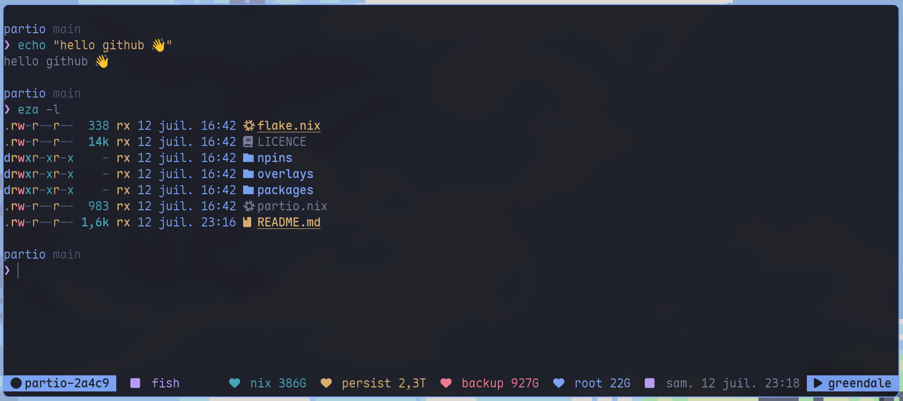

# 👜 Partio



This is a subset of my dotfiles that serves two purposes:

- I do not want to share all of my dotfiles since I may leak secrets, but still want to share some stuff
- I can use this as a portable config: since everything is wrapped I can just invoke it with `nix` and have my minimal config really quickly

## Usage

### CLI

You can try it with

```bash
nix run github:rx342/partio
```

Note that because everything is wrapped, your configuration files should not be altered in any way (otherwise please [create an issue](https://github.com/rx342/partio/issues))!

Since it is _personal_, it has some very opinionated options and should only be used temporarily (unless you want to have my identity, _e.g._ my git name & email, and other things on your computer).
You can also check my wrapped `nvim` config: [rx342/nvim](https://github.com/rx342/nvim).

### Overlay

This repository also exposes every wrapped packages so you can pull them easily via an overlay.

```nix
# without flakes
pkgs = import <nixpkgs> {
  overlays = [ (import "${./path/to/partio}/overlays/default.nix") ]
  ...
};

# with flakes
pkgs = import nixpkgs {
  overlays = [ inputs.partio.overlays.default ];
  ...
};
```

and install packages like the following

```nix
environment.systemPackages = with pkgs.rx342; [
  fish
  tmux
  wezterm
];
```

### Binary cache

There is a binary cache you can use

```nix
nix = {
  settings = {
    substituters = [
      "https://partio.cachix.org"
    ];
    trusted-public-keys = [
      "partio.cachix.org-1:W8w3kE6/UOLs0dg1kxCDYvllNVsaBFbNBofVR+wYhrw="
    ];
  };
};
```

## Credits

- [viperML/wrapper-manager](https://github.com/viperML/wrapper-manager)
- [viperML/dotfiles](https://github.com/viperML/dotfiles)
- [sioodmy/andromeda](https://github.com/sioodmy/andromeda/tree/main)
- [ifd3f/infra](https://github.com/ifd3f/infra)
- [isabelroses/dotfiles](https://github.com/isabelroses/dotfiles)
- [Ruixi-rebirth/flakes](https://github.com/Ruixi-rebirth/flakes)
- [redyf/nixdots](https://github.com/redyf/nixdots)
- [sioodmy/dotfiles](https://github.com/sioodmy/dotfiles)
- [fufexan/dotfiles](https://github.com/fufexan/dotfiles)
- [wochap/nix-config](https://github.com/wochap/nix-config)
