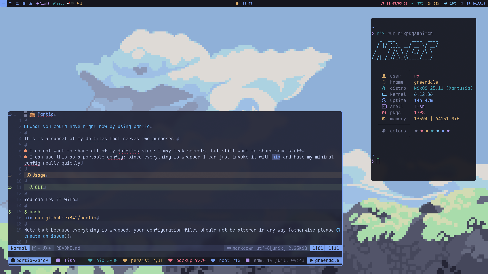
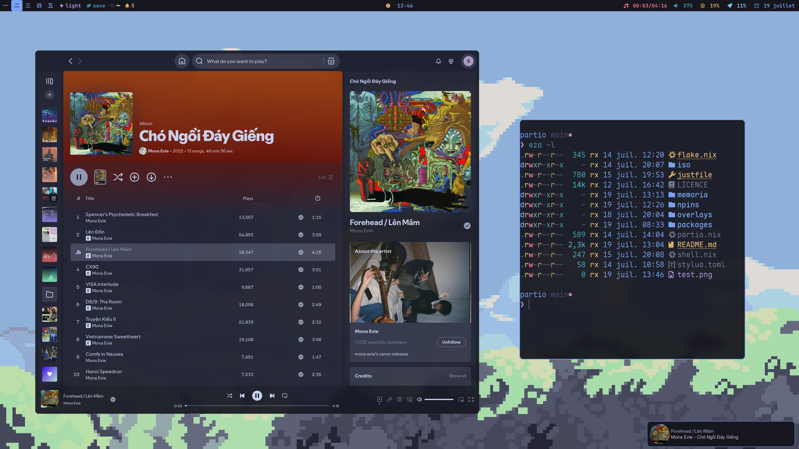

# cat in clouds

| Module          | Name     | Package                   |
| --------------- | -------- | ------------------------- |
| 🐚 **Shell**    | Fish     | `pkgs.rx342.fish`         |
| 📟 **Terminal** | Wezterm  | `pkgs.rx342.wezterm`      |
| 📝 **Editor**   | Neovim   | `pkgs.rx342.neovim`       |
| 🚀 **Launcher** | Rofi     | `pkgs.rx342.rofi-wayland` |
| 🖼️ **WM**       | SwayFX   | `pkgs.rx342.swayfx`       |
| 🔲 **Bar**      | Waybar   | `pkgs.rx342.waybar`       |
| 🔒 **Lock**     | Swaylock | `pkgs.rx342.swaylock`     |
